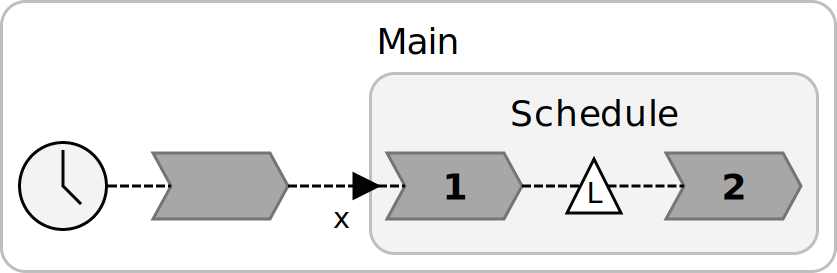

## Overview
The Eclipse-based LF IDE also provides automatically synthesized diagram representations for LF programs. They are based on the idea of _transient views_ that are created on-demand and usually focus on certain aspects of the program. This fits especially well with textual languages, such as LF, where a diagram allows for a fast and intuitive understanding of the general structure and important aspects of a program while the textual representation enables comfortable editing of every detail. A key enabler of this approach
is the automatic layout. It removes the tedious task of manually arranging elements in a diagram, which is especially undesirable when you are not even editing graphically in the first place. We implemented the diagram synthesis for LF with the KIELER Lightweight Diagrams framework.

## Enabling Diagram Synthesis
To be able to render diagrams in the Lingua Franca Eclipse runtime, some Eclipse plugins are required. If you [installed the Eclipse developer setup](Developer-Eclipse-Setup-with-Oomph), then you already have these plugins. If not, instructions are provided here.

You can install these in the regular Eclipse editor; the LF runtime will inherit them.

* Go to `Help -> Install New Software -> Add Update Site`
* Add [https://kieler.github.io/KLighD/](https://kieler.github.io/KLighD/)
* Install: `Kieler Lightweight Diagrams Generic View`, `Kieler Lightweight Diagrams Runtime`, and `KIELER Lightweight Diagrams Vector Graphics Export Powered by FreeHEP`. For debugging purposes, it may also be useful to install the respective source packages, which are also available through the KLighD update site.

Now, start the LF Eclipse runtime as you normally would, open an `.lf` file and (next to the Console) click on the Diagram tab. If you don't have a Diagram tab, go to Window -> Show View -> Other and filter on the word "Diagram". A graphical rendering of the LF source should appear.

## Example
Consider the following code:
```
// Example from Schedule section of the C Reactor Target wiki page.
target C;
reactor Schedule {
    input x:int;
    logical action a;
    reaction(x) -> a {=
        schedule(a, MSEC(200), NULL);
    =}
    reaction(a) {=
        interval_t elapsed_time = get_elapsed_logical_time();
        printf("Action triggered at logical time %lld nsec after start.\n", elapsed_time);
        if (elapsed_time != 200000000LL) {
            printf("Expected action time to be 200 msec. It was %lld nsec.\n", elapsed_time);
            exit(1);
        }
    =}
}
main reactor Main {
    a = new Schedule();
    timer t;
    reaction(t) -> a.x {=
        set(a.x, 1);
    =}
}
```
This code results in the following diagram:
